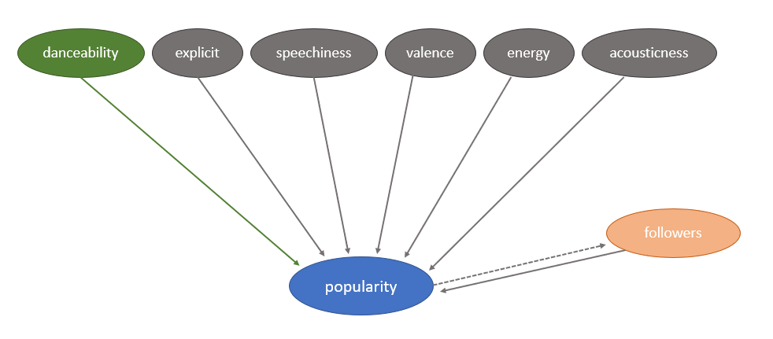

```{r setup, include=FALSE}
knitr::opts_chunk$set(echo = TRUE)
library(dplyr)
library(stringr)
library(tidyverse)
library(stargazer)
library(sandwich)
library(lmtest)
#install.packages('corrplot')
#library(corrplot)
```

```{r read data, include=FALSE}
# d_artists <- read.csv("data/artists.csv", header = TRUE)
# d_tracks <- read.csv("data/tracks.csv", header = TRUE)
# 
# # add followers and popularity of artist
# d_tracks$id_artists <- str_sub(d_tracks$id_artists, 3)
# d_tracks$id_artists <- substring(d_tracks$id_artists,1, nchar(d_tracks$id_artists)-2)
# d_artists$id_artists <- d_artists$id
# d_artists$artist_popularity <- d_artists$popularity
# d_artists = d_artists[,c('id_artists','artist_popularity','followers')]
# d_tracks = d_tracks %>% inner_join(d_artists, by='id_artists')
# rm(d_artists)
# d_tracks = d_tracks[sample(seq_len(nrow(d_tracks)),size = nrow(d_tracks)*0.3),]
# d_tracks = d_tracks[,c('popularity','artist_popularity','followers','danceability','acousticness','speechiness','valence','explicit','energy','acousticness')]
```

```{r, corrplot, echo=FALSE, warning = FALSE, results = 'asis'}
# corrplot(cor(d_tracks[,c('popularity','danceability','explicit','speechiness','valence','energy','acousticness')]), 
#          method = 'number', type = 'lower', diag = FALSE, cl.pos = 'n')
```

```{r, models, include=FALSE}
# model = lm(popularity ~ danceability, data = d_tracks)
# saveRDS(model, "model_0.rds")
# model = lm(popularity ~ danceability + explicit + speechiness + valence, data = d_tracks)
# saveRDS(model, "model_1.rds")
# model = lm(popularity ~ danceability + explicit + speechiness + valence + energy + acousticness, data = d_tracks)
# saveRDS(model, "model_1b.rds")
# model = lm(log(popularity) ~ danceability + explicit + speechiness + valence + energy + acousticness, data = d_tracks[d_tracks$popularity>0,])
# saveRDS(model, "model_1bl.rds")
# model = lm(popularity ~ danceability + explicit + speechiness + valence + acousticness, data = d_tracks)
# saveRDS(model, "model_1c.rds")
# model = lm(popularity ~ danceability + explicit + speechiness + valence + energy, data = d_tracks)
# saveRDS(model, "model_1d.rds")
# model = lm(popularity ~ danceability + explicit + speechiness + valence + followers, data = d_tracks)
# saveRDS(model, "model_2.rds")
# model = lm(popularity ~ danceability + explicit + speechiness + valence + energy + acousticness + followers, data = d_tracks)
# saveRDS(model, "model_2b.rds")
# model = lm(popularity ~ danceability + explicit + speechiness + valence + log(followers), data = d_tracks[d_tracks$followers>0,])
# saveRDS(model, "model_3.rds")
#model = lm(popularity ~ danceability + explicit + speechiness + valence + energy + acousticness + log(followers), data = d_tracks[d_tracks$followers>0,])
#saveRDS(model, "model_3b.rds")

```

```{r read models, include=FALSE}
model_0 <- readRDS("model_0.rds")
#model_1 <- readRDS("model_1.rds")
#model_2 <- readRDS("model_2.rds")
#model_3 <- readRDS("model_3.rds")

model_1b <- readRDS("model_1b.rds")
#model_1bl <- readRDS("model_1bl.rds")
#model_2b <- readRDS("model_2b.rds")
model_3b <- readRDS("model_3b.rds")
```

```{r save coeffs, include=FALSE}
mod_0_r2 = round(summary(model_0)$r.squared,3)
mod_0_coef = round(coeftest(model_0, vcov= vcovHC(model_0))[2],3)

mod_1b_r2 = round(summary(model_1b)$r.squared,3)
mod_1b_coef = round(coeftest(model_1b, vcov= vcovHC(model_1b))[2],3)
mod_1b_coef3 = round(coeftest(model_1b, vcov= vcovHC(model_1b))[3],3)
mod_1b_coef4 = round(coeftest(model_1b, vcov= vcovHC(model_1b))[4],3)
mod_1b_coef5 = round(coeftest(model_1b, vcov= vcovHC(model_1b))[5],3)
mod_1b_coef6 = round(coeftest(model_1b, vcov= vcovHC(model_1b))[6],3)
mod_1b_coef7 = round(coeftest(model_1b, vcov= vcovHC(model_1b))[7],3)
mod_1b_len = length(residuals(model_1b))

mod_3b_r2 = round(summary(model_3b)$r.squared,3)
mod_3b_coef = round(coeftest(model_3b, vcov= vcovHC(model_3b))[2],3)
mod_3b_coef3 = round(coeftest(model_3b, vcov= vcovHC(model_3b))[3],3)
mod_3b_coef4 = round(coeftest(model_3b, vcov= vcovHC(model_3b))[4],3)
mod_3b_coef5 = round(coeftest(model_3b, vcov= vcovHC(model_3b))[5],3)
mod_3b_coef6 = round(coeftest(model_3b, vcov= vcovHC(model_3b))[6],3)
mod_3b_coef7 = round(coeftest(model_3b, vcov= vcovHC(model_3b))[7],3)
mod_3b_coef8 = round(coeftest(model_3b, vcov= vcovHC(model_3b))[8],3)
```

# 4. A Results Section
```{r, results, echo=FALSE, warning = FALSE, results = 'asis'}
stargazer(model_0, model_1b, model_3b, 
          se=list(sqrt(diag(vcovHC(model_0))), sqrt(diag(vcovHC(model_1b))), sqrt(diag(vcovHC(model_3b)))),
          font.size = "small", 
          column.sep.width = "1pt",
          #omit.stat=c("adj.rsq"),
          float = FALSE,
          header=FALSE,
          type = 'latex')
```

         
There is statistical significance in all of the three models. The coefficient for our predictor variable of interest is consistent across models and is big enough to validate at a first stage our theory of danceability determining popularity of a song. Robust standard errors have been used in all the models. 

The model (1) has a $R^2$ of **`r mod_0_r2`** and an effect size for danceability of **`r mod_0_coef`**. $R^2$ is low, which means there is a big part of the variability in our target variable that is not explained by the model. But since the aim of the study is to explain causal relationships rather than predicting, we will focus in the effect size of danceability, which is big enough to back our theory. For each unitary increase in danceability, the song's popularity should increase by **`r mod_0_coef`**. To put this in context, It is important to note that by definition, danceability ranges from 0 to 1 and popularity from 0 to 100.

The second model (2) incorporates other features we consider important to determine the popularity of a song. The coefficient of determination increases significantly to **`r mod_1b_r2`** and the effect size of danceability increases from **`r mod_0_coef`** to **`r mod_1b_coef`**. The effect sizes for explicit, speechiness and valence are `r mod_1b_coef3`, `r mod_1b_coef4` and `r mod_1b_coef5` respectively, being all three statistically significant. For the remaining 2 variables, energy and acousticness add predictive power to the model but are highly correlated. Therefore, the interpretation of these coefficients (`r mod_1b_coef6` and `r mod_1b_coef7` respectively) should take this into account.

The last model (3) adds the artist's followers into the equation, arising a previously introduced reverse causality problem. Therefore, there could be violations to the one-equation structural model. The variable is log-transformed and the model increases its $R^2$ to **`r mod_3b_r2`** and the effect size of danceability is **`r mod_3b_coef`**, which is a similar level than the one of model (2). The effect size of the predictors present in the model (2) vary in some variables but remains robust at least for the sign and the relative absolute value, being `r mod_3b_coef3`, `r mod_3b_coef4` and `r mod_3b_coef5`, `r mod_3b_coef6` and `r mod_3b_coef7` for explicit, speechiness, valence, energy and acousticness respectively. The coefficient for the log of followers is `r mod_3b_coef8`, which is interpreted as a 1% increase in followers make `r mod_3b_coef8` increase in the song`s popularity. This interpretation may not represent the reality because of the violations to the one-equation structural model.

To sum up, the effect size of our variable of analysis, danceability is consistent to any of the feature additions respect the base model (1), which means that there is a causal relationship between danceability and popularity. As a result, increasing danceability of a song can produce an increase on the song's popularity. The coefficients of determination increase significantly with the addition of features, wut we have to reject the use of the third model in favor of the model (2), because of a reverse causality problem with the artist's followers and the song's popularity.

Then, we will select the following model:
$$popularity = \beta_0 + \beta_1danceability + \beta_2explicit + \beta_3speechiness + \beta_4valence + \beta_5energy + \beta_6acousticness$$

# 5. Limitations of your Model 

Possible limitations of the model are the fulfillment of the large sample assumptions (IID and unique BLP) and limitations to the structural model, such as omitted variable bias and violations to the one-equation structural model.

## 5.a Large sample model assumptions

The assumptions for the large sample model are:

  1. I.I.D. data (Independent and Identically Distributed)
  2. Unique BLP existence

Also, we need to have a large sample size so that we can rely on asymptotics, which is the case for our dataset.

  1. I.I.D. data (Independent and Identically Distributed)
  
The dataset once cleaned of rows containing NA’s, contains `r mod_1b_len` songs. Are songs independent of each other such as knowing one song does not provide any information on any other songs?

We can wonder how the songs were selected by Spotify. We can suppose that a logical process has been applied to select songs. We can strongly doubt that songs were randomly selected by Spotify.

From a technical point of view, data can be considered clustered as artists can produce several songs. Songs from similar artists might share musical characteristics making them not independent of each other. 

Aggregating data by artist_id reveals that half of the artists (15985 over 33215) have one single song in the dataset, nevertheless, the other half have more than 1 song. Can be pointed out some extreme cases such as id_artists (3meJIgRw7YleJrmbpbJK6S ->name?) that has 1140 songs on Spotify.
Nevertheless, a song might not be identifiable only focusing on technical considerations difficult to perceive by listeners. Each song has its DNA and thus its own Identity. Song’s unicity balances the previous arguments and contributes to making data IID enough to perform our study.  

  2. Unique BLP existence

A BLP exists when the covariance between predictors and the covariance between predictors and target variable is finite. If a BLP exists, it is unique when there is no perfect multicolinearity between features. In other words, any feature can be expressed as linear combination of other features.

By looking at how the features are created (based on musical elements, tempo, BPM, decibels, etc), it is difficult to think there could be perfect multicolinearities. There are no fat tails on the distributions of features and any of the models dropped any feature or raised any warning on multicolinearity. Also, although the correlation plot could only show perfect colinearity between two features, none of the pairs present evidence of it.

There is evidence enough to assure this assumption is met.

## 5b. Structural limitations of your model

The causal diagram considering all the analyzed variables is shown in the figure below:  
*Note the selected model (2) does not include the relationship between followers and popularity.


**Omitted variable bias**

We have identified a potential omitted variable that may have a significant effect on a song's popularity, which is the promoting power that the record company is putting into the song. We consider this feature has a positive effect size on the song's popularity and therefore, the coefficients may be biased, meaning this that the coefficients of the true structural model may differ from the coefficients of our model.

Since we do not have the information we can only discuss about the sign and strength of the bias. For danceability, the Omitted Variable Bias is $\tilde{\beta_1} - \beta_1 = \beta_{prom} \delta_1$. We could expect $\beta_{prom}$, which is the coefficient for the omitted variable in the original model, to be positive. $\delta_1$ is the effect size of danceability in a model with the original features regressing the unknown variable, the promoting power, for which we can not form an opinion about direction and size. Therefore, we can only state that the variable promoting power may modify the coefficients.

**Reverse causality**

We consider that there could be a reverse pathway in the structural model that can violate the one-equation structural model. The artist's number of followers can be a cause for a song's popularity but also creating popular songs can increase the number of followers. For this reason, we selected model (2) over (3).

# 6. Conclusion


