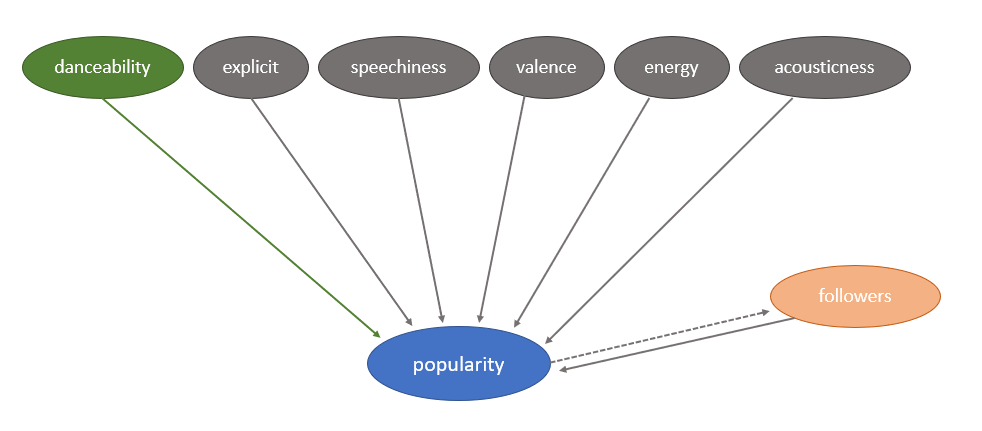

```{r setup, include=FALSE}
knitr::opts_chunk$set(echo = TRUE)

library(tidyverse)
library(dplyr)
library(ggplot2) 
library(lmtest)
library(sandwich)
library(stargazer)
library(sandwich)
library(janitor)
library(gridExtra)
library(car)
library(stringr)
#install.packages('corrplot')
library(corrplot)
```

```{r, echo=FALSE}
# Load in data 
d_artists <- read.csv("src/data/artists.csv", header = TRUE)
d_tracks <- read.csv("src/data/tracks.csv", header = TRUE)

# Get quick looks
# summary(d_artists)
# summary(d_tracks)

# Remove first two characters [' for artists 
d_tracks$artists <- str_sub(d_tracks$artists, 3)
#Remove last two characters '] for artists 
d_tracks$artists <- substring(d_tracks$artists,1, nchar(d_tracks$artists)-2)

# Remove first two characters [' for id_artist
d_tracks$id_artists <- str_sub(d_tracks$id_artists, 3)
#Remove last two characters '] for id_artist
d_tracks$id_artists <- substring(d_tracks$id_artists,1, nchar(d_tracks$id_artists)-2)

# Selecting relevant artist columns: id, followers, popularity 
d_artists$id_artists <- d_artists$id
d_artists$artist_popularity <- d_artists$popularity
d_artists <- d_artists %>% select(id_artists, followers, artist_popularity)

# Join d_artists and d_tracks on artist id
d_joined <- merge(x = d_tracks, y = d_artists, by = "id_artists", all.x = TRUE)

# Change id name to specify for songs 
d_joined$id_song <- d_joined$id

# Select only likely necessary variables (e.g. we don't really need song name)
d <- d_joined %>% 
  select(id_song,popularity,explicit,danceability,energy,speechiness,acousticness,instrumentalness,valence,followers) %>%
  filter(followers > 0)
  

# Check for NAs in filtered dataset
# summary(d)
# There are 117089 NAs for followers and artist_popularity 
# Suggest Filtering out these rows
d <- na.omit(d)
# summary(d) # Check 

#Create an exploration and testing subsets

exploration_size<-floor( nrow(d)*0.3)  # number of rows we are going to select, 30% of the dataset
set.seed(777)
random_selection = sample(seq_len(nrow(d)),size = exploration_size) #random selection of x rows


d_explore <- d[random_selection,] # the randomly selected rows for the exploration dataset
d_test <- d[-random_selection,]  #full dataset - previously selected rows = the testing dataset

d_explore <- d_explore %>% select(id_song, popularity, explicit, danceability, energy, speechiness, acousticness, valence, followers)
d_test <- d_test %>% select(id_song, popularity, explicit, danceability, energy, speechiness, acousticness, valence, followers)

```

# 1. Introduction
Throughout history, the role of music and dance has almost always had an important role in personal, social, religious, and cultural settings. Depending on the context, both art forms have the ability to bring on to feel certain emotions, and leave a lasting impression to their audience. What is intriguing is how music can induce one to move their body to the song as a reaction - i.e. dance. While the want to dance or move along to a song can be strong, is this want to dance the strongest impression that can make one like a song? 

Today more people have access to music and there is more music to access than ever before. Competition among artists trying to create music with  widespread popularity has become fierce, forcing many in the music industry to question what makes a song “popular”? What makes a song resonate with people? While music itself is an art, and understanding what makes a song popular can be subjective and vary by context, it is intriguing to wonder if there are certain reactions listeners at the mass level have that help make a song popular. If a song can make people move, is that a sign of a song's success?  

It is in this context that this paper would like to investigate *to what extent the danceability of a song determines its overall popularity?*

As artists and record companies try to strive for mass popularity, this study can provide insight whether this type of reaction to a song should be a major goal to consider when composing, writing, and producing songs. This study uses data from Spotify, the online music platform, which has information on song mechanics (such as danceability) and song popularity to explore this relationship.^[source: https://developer.spotify.com/documentation/web-api/reference/#/operations/get-track] While this study will only be able to speak to the popularity of music on Spotify's platform, it could still provide valuable insight on the role of danceability in a song’s popularity that could be applied to other music streaming platforms or music entities/associations. 

# 2. Data and Research Design

## 2a. Dataset 
The data in this study was accessed via the website Kaggle.^[https://www.kaggle.com/datasets/lehaknarnauli/spotify-datasets] The dataset was originally retrieved from Spotify's Web API and uploaded to Kaggle in October 2021. As such, the results of this study will be relevant to the popularity of songs on Spotify in October 2021 and the trends associated with this moment in time. ^[https://developer.spotify.com/documentation/web-api/guides/using-connect-web-api/] Furthermore, according to documentation on Spotify's Web API, the dataset being used (accessed from Kaggle) does not include other non-song tracks that are available on Spotify's platform such as podcasts, as those are organized in different datasets and have different variables associated with them. As such it can be assured that each observation pertains only to songs and their characteristics.  

Two CSVs were provided by Kaggle, one containing characteristics about different artists for each song, and another CSV on tracks containing characteristics about the song mechanics. The artists dataset contained 1,104,349 observations, and the tracks dataset contained 586,672 observations; in both cases each observation referring to one song. As both datasets contained relevant variables for this investigation, the tables were joined resulting in 586,672 observations. After checking for invalid values and filtering out NAs, 467,654 observations remained in the finalized dataset. 

## 2b. Sample
Testing models on the same sample exploratory data analysis (EDA) is conducted on can lead to overfitting, where the model may overweight unimportant variables.To avoid this issue, the dataset was split into exploration and testing subsets. The finalized dataset, containing 467,654 observations was randomly split by 30%, containing 140,296 rows, and 70%, containing 327,358 rows. The 30% subset was used to conduct EDA, while the 70% subset was used to test the models. Both subsets included the exact same variables. 

## 2b. Research Design 
This study aimed to investigate the causal mechanisms at hand between the danceability of a song (main explanatory variable) and its popularity (outcome variable) and did so by developing explanatory models using ordinary least squares (OLS) linear regressions.The OLS regression, under the large sample assumptions, will be used to estimate the best linear predictor. First a simple model was created looking at just popularity and danceability. Then additional models were created to better understand the strength of that the relationship between danceability and song popularity  Further details are explained *Section 3b: Proposed Models.*

# 3. EDA and Model Development

## 3a. Exploratory Data Analysis  

### Popularity and Danceability 
The main variables considered in this study were song popularity and danceability. Spotify calculates *popularity* to be a value between 0 (least popular) and 100 (most popular).^[https://developer.spotify.com/documentation/web-api/reference/#/operations/get-track] They use an in-house developed algorithm based mostly on the total number of plays a song has had and how recent those plays have been.Songs that have been more recently been played a lot have a higher popularity than songs play a lot in the past. Duplicate tracks that were released as both singles and on an album or on multiple albums are rated independently by Spotify.

In the dataset provided, the popularity scores have been rounded to the nearest whole number, but based on the information provided from Spotify's Web API, it does seem that the scores were calculated using quantitative metrics in their algorithm. But also there is an understanding of the difference between each score (1, 2, 3, etc.) increasing with the same level of popularity. Additionally, research suggests that even categorical rank scales produce useful summary metrics given a large number of scale intervals. Wu and Leung (2017) find that Likert scales with more than 5 intervals produce valid and consistent parametric test results, and that scales with a high number of levels minimize any potential differences between the intervals.^[https://www.tandfonline.com/doi/abs/10.1080/01488376.2017.1329775] As the popularity variable has 100 possible different values and increasing by one at the same rate of popularity, the popularity variable can indeed be considered as a metric variable in this scenario. 

*Danceability* is rated on a scale from 0 to 1, and describes how suitable a track is for dancing based on the following musical elements: tempo, rhythm stability, beat strength, and overall regularity. A danceability score of 0.0 indicates the song is not danceable at all; a score 1.0 indicates the song is the most danceable.

The below histograms show the distribution of both the popularity and danceability variable:

```{r, fig.width=8,fig.height=3, fig.align='center', echo=FALSE}
p1 <- ggplot() +
  aes(x = d_explore$popularity) +  
  geom_histogram(bins = 20) + 
  labs(
    x = "Popularity",
    y = "Count",
    title = "Figure 1: Distribution of Popularity"
  )

p2 <- ggplot() +
  aes(x = d_explore$danceability) +  
  geom_histogram(bins = 20) + 
  labs(
    x = "Danceabilty",
    y = "Count",
    title = "Figure 2: Distribution of Danceability"
  )

grid.arrange(p1, p2, nrow = 1, ncol = 2)
```
Looking at Figure 1, popularity seems to be right skewed, with a majority of songs having a score of less than 50 and no major clusters in its distribution. Very few songs seem to be greater than this score, and this study will aim to see to what extent danceabilty helped those songs get such high popularity scores. Figure 2 shows the distribution of danceability, which appears to have somewhat of a normal distribution with a slight left skew. Based on these graphs, there is no immediate need to consider applying a transformation on either of these variables. 

```{r, fig.align='center', fig.height=8, fig.width=6, echo=FALSE}
p3 <- ggplot(d_explore,
  aes(y=popularity,x=danceability, group = popularity)) + 
  geom_boxplot() + 
  labs(
    x = "Danceability", 
    y = "Popularity", 
    title = "Figure 3: Distribution of Danceability by Popularity Score"
  )

p3
```

Figure 3 above shows the distribution of the danceability score for each song popularity score from 0 to 100.^[A simple scatterplot of danceability vs popularity would be hard to read given the large number of data points and variance.] It is clear from this figure that there is quite a range of danceability scores at each score. But as the score increases, the median of the danceability also starts to increase; this is especially strong from score 75 and above. This gives the idea that danceability could have a positive relation on song popularity.But given the wide variances seen here and the amount of levels it has to go through, what is not known is how strong this relation might be. Hopefully this will be answered by the regression models.  

### Other Variables 
Danceability is most likely not the only factor contributing to the popularity of a song. Factors related to the mechanics of the song^[Interiano, M., Kazemi, K., Wang, L., Yang, J., Yu, Z., Komarova, N.L. (2018) Musical trends and predictability of success in contemporary songs in and out of the top charts. Royal Soc Open Science 5, no. 5: 171274.] and artist popularity would probably also influence a song's popularity score on Spotify. This information is available in the dataset being used. 

In relation to the sound and musicality of the of a song, the below explanatory variables were chosen^[https://developer.spotify.com/documentation/web-api/reference/#/operations/get-track]: 

> *Explicitness*: a dummy variable on whether or not a song has explicit lyrics; 1 = yes and 0 = no. The presence of explicit lyrics may indicate a high level of emotion associated with the song lyrics which could contribute to lasting impression of a song on a person and help increase its popularity.

> *Speechiness*: a measure from 0.0 to 1.0, speechiness detects the presence of spoken words (e.g. rap music) in a track. The higher the value, the higher the presence of spoken words in the track. With the rise in rap music, and increase in spoken words in songs in recent decades, speechiness would help capture how popular this aspect in songs has been. But given that these songs with a higher speechiness value are likely only a portion of the songs available on Spotify's platform (as so many other music genres don't have this characteristic), it could be that most popular songs may tend towards lower speechiness values. 

> *Valence*: a measure from 0.0 to 1.0 describing the musical positiveness conveyed by a track. A high valence score indicates that a track sounds more happy, cheerful, and euphoric, while a low score would be given to tracks sounding more negative such as sad, depressed, or angry. In relation to a song's popularity, the research team believes that a higher valence score may tend to be associated with higher popularity, based on a study done at University of California Irvine.^[Interiano, M., Kazemi, K., Wang, L., Yang, J., Yu, Z., Komarova, N.L. (2018) Musical trends and predictability of success in contemporary songs in and out of the top charts. Royal Soc Open Science 5, no. 5: 171274.] While the study did not go into depth on the causal mechanisms at hand (focused on prediction of song popularity), the researchers in this study think that while strong positive or negative valence could both leave a strong impression on a person listening to the song in question, it is more likely that more people would repeat listens of songs that have a more positive feel because likely it leaves the person in a more positive mood after the listen. 

> *Energy*: refers to a perceptual meausure of intensity and activity, and is measured on a scale from 0.0 to 1.0. Specifically, intensity and activity are based on attriutes such as dynamic range,^[The ratio of the loudest peak to the quietest in a recording, expressed in decibels (dB).] perceived loudness, timbre,^[Timbre describes the characteristics of sounds that allow the ear to distinguish different sounds which may have the same pitch and loudness. For example, if a guitar and a violin both play the same note C# sharp in the same musical key, they will sound different. From a physics point of view, the timbre of a sound will depend on its wave form, which varies with the number of overtones or harmonics, their frequencies, and their relative intensities that are present. Source 1:http://hyperphysics.phy-astr.gsu.edu/hbase/Sound/timbre.html; Source 2: https://www.britannica.com/science/timbre] onset rate,^[The beginning of a musical note or sound.] and general entropy.^[High entropy is correlated with more meaningful musical events in a track. Source: Cox, Gregory. (2010). On the Relationship Between Entropy and Meaning in Music: An Exploration with Recurrent Neural Networks.] More energetic tracks will sound more loud, fast, and noisy, and will have a higher energy score. Likely, more energetic tracks could leave a greater lasting impression on a person as it more likely will invoke emotions of that person and leave a more lasting impression, as compared to a low energy tracks which could be played in the background (e.g. elevator music). For this reason, high energy music could be correlated with high popularity of a song. It should also be noted that energy and danceability do not have a strong correlation with one another as some might expect: `r round(cor(d_explore$danceability, d_explore$energy), 2)`.

> *Acousticness*: a measure from 0.0 to 1.0 on whether the track is acoustic14, with a higher value indicating higher acousticness.With the rise of electronic music genres (e.g. house, trap, dub step, electronic dance music) in today’s day and age (especially in October 2021 when this data set was retrieved from Spotify), and the fact that popular music (intended to reach a wide commerical audience who tend to have access to a lot of music15) has been becoming less acoustic in recent decades, acousticness may have a negative relation with popularity, given the year.^[https://www.theguardian.com/technology/2013/nov/25/pop-music-louder-less-acoustic]

> *Number of Artist Followers*: the number of Spotify followers for the artist of the song in question and a proxy for the song's artist popularity. The more followers an artist has, the easier it is for the songs to get more plays (crucial in calculating the popularity score) because followers get notified when a new song by the artist they follow gets released and they are actively encouraged to play that song.But alternatively, a song that becomes popular will also make the artist more popular and lead to an increase in followers for that artist. This reverse causality will be discussed and dealt with in further detail in *Section 3b: Model Building*. 

```{r, fig.width=8, fig.height = 12, fig.align='center', echo=FALSE, warning=FALSE}
p4 <- ggplot() +
  aes(x = d_explore$explicit) +  
  geom_histogram(bins = 20) + 
  labs(
    x = "Explicitness",
    y = "Count",
    title = "Figure 4: Distribution of Explicitness"
  )

p5 <- ggplot() +
  aes(x = d_explore$speechiness) +  
  geom_histogram(bins = 20) + 
  labs(
    x = "Speechiness",
    y = "Count",
    title = "Figure 5: Distribution of Speechiness"
  )

p6 <- ggplot() +
  aes(x = d_explore$valence) +  
  geom_histogram(bins = 20) + 
  labs(
    x = "Valence",
    y = "Count",
    title = "Figure 6: Distribution of Valence"
  )

p7 <- ggplot() +
  aes(x = d_explore$energy) +  
  geom_histogram(bins = 20) + 
  labs(
    x = "Emergy",
    y = "Count",
    title = "Figure 7: Distribution of Energy"
  )

p8 <- ggplot() +
  aes(x = d_explore$acousticness) +  
  geom_histogram(bins = 20) + 
  labs(
    x = "Acousticness",
    y = "Count",
    title = "Figure 8: Distribution of Acousticeness"
  )

p9 <- ggplot() +
  aes(x = d_explore$followers) +  
  geom_histogram(bins = 20) + 
  labs(
    x = "Number of Artist Followers",
    y = "Count",
    title = "Figure 9: Distribution of Followers"
  )

p10 <- ggplot() +
  aes(x = log(d_explore$followers)) +  
  geom_histogram(bins = 20) + 
  labs(
    x = "Number of Artist Followers",
    y = "Count",
    title = "Figure 10: Distribution of No. of Followers (ln)"
  )

grid.arrange(p4, p5, p6, p7, p8, p9, p10, nrow = 4, ncol = 2)
```
The above figures show the distribution of the other predictor variables in consideration. All of the variables in Figures 4-10 are based on a scale from 0 to 1 except for explicitness and number of artist followers. Explicitness is a dummy variable as mentioned earlier. The distribution of the number of artist followers as shown in Figure 9 does seem to be clustered on the left hand side of the graph and does have a large range in values. As such, the natural log will be taken (Figure 10) and applied to the regression models when included. No other transformations were applied even though some clustering was noticed in speechiness because the rest of the variables are all on the same comparable scale, and the need for it is not as great to transform. 

### Song Genre
On an additional note, it was collectively decided to not incorporate the genre of each song in the model. The biggest reason being that many songs were associated with more than one genre, and as music evolves and artist fuse elements of different genres in their music, it becomes more subjective as what genres songs are identified with. For example, Rosalia, a renknowned Spanish artist originally started off singing Spanish folk music, specifically in a flamenco music group called Kejaleo and released an album with them called Alaire in 2013 (also available on Spotify). As the years progressed, she evolved as a solo artist mixing in influences of reggaeton and hip hop in her tracks. As a result many of her tracks could be considered to be a part of multiple genres.

Another issue with genre is that some genres themselves aren't necessarily independent of each other, with the rise of micro-genres on Spotify's platform. As of 2021, Spotify recorded 5,071 different genres (including microgenres), and it is hard to believe that each genre had enough differentiating features that truly speak out to each song (which is likely why songs on Spotify and other music platforms may be associated with more than one genre). In fact even in some of the main genres of music it is quite clear there is overlap between musical elements. For instance, in the K-Pop genre there are many songs by the band and Big Bang whose songs are hip hop in the musical sense, such as "Bad Boy" and "Haru Haru", but tend to be identified as K-pop in the global music industry because the songs are in Korean and the band started out in the traditional K-pop space. 

Due to the high level of subjectiveness with genres, this study leaves it out of the models, choosing to focus more on the song mechanics and artist popularity which likely might capture some of the genre effects (e.g. a Hindustani or Carnatic song on Spotify likely will be more acoustic as usually instruments in such songs have no electric amplification), and focus more on *overall* song popularity.

### Correlation Between Predictors
Of the predictors selected above,a correlation matrix was derived in an attempt to highlight any potential collinearity between the variables (Figure 11). It was immediately noticed that there was a high negative correlation between energy and acousticness (-0.72). To make the model coefficients easier to interpret, it was decided to remove acousticness. The information energy represents was collectively (by the research team) seen to be more straightforward of a variable to interpret.

**Figure 11: Correlation Matrix**

```{r, corrplot, echo=FALSE, warning = FALSE, results = 'asis', fig.height=7}
corrplot(cor(d_tracks[,c('popularity','danceability','explicit','speechiness','valence','energy','acousticness')]), 
          method = 'number', type = 'lower', diag = FALSE, cl.pos = 'n')
```

## 3b. Proposed Models  
Based on the EDA done, the below proposed models will be tested: 

**Model 1: Simple Regression between popularity and the main predictor variable danceability**
It is likely that there is a one-way relationship between the danceabilty and a song's popularity, resulting in no violation of OLS regressions rules. A song's danceability can influence its popularity, but a song's popularity cannot influence its danceability because the danceability factor would have already existed before the song was released on Spotify and allowed to gain popularity. As such, model 1 is defined as below:
$$popularity = \beta_0 + \beta_1danceability + \epsilon$$
**Model 2: Multiple regression including other explanatory variables except for number of artist followers on Spotify**
This model will aim to account for the omitted variable bias likely present in the first model (unlikely that danceability is the only significant factor in determining a song's popularity). Specifically, variables providing information on the mechanics of a song and an artist's popularity. But one could argue that the true model might contain both a causal pathway from predictors to outcome variable and a reverse causal pathway from outcome variable to predictors; specifically between the popularity of a song and the popularity of an artist. The popularity of an artist could contribute to a song's popularity, while inversely and successful song could increase the artists' popularity. For this reason this model will focus only on the mechanics of the song, and the third model will consider artist popularity to have a comparison. In this model, the OLS one-structural problem rules are not violated. 

Given the above considerations, model 2 is defined as below: 
$$popularity = \beta_0 + \beta_1danceability + \beta_2explicitness + \beta_3speechiness + \beta_4valence + \beta_5energy + \epsilon$$
**Model 3: Multiple regression including all available explanatory variables**
As mentioned above, there is reason to believe that the popularity of an artist can influence a song's popularity and vice-versa. As such, this third model will include the number of artist followers on the Spotify platform (a measure of artist popularity), and will be interesting to compare with the second model and evaluate the reverse causality at hand. 

This bilateral relationship makes popularity a function of the ‘number of followers’ and ‘the number of followers’ a function of popularity. In addition to the structural equation defined below for model two, the structural equation for regressing the number of followers on popularity also has to be considered. The error term $\delta$ from $followers = \gamma_0+ \gamma_1popularity + \delta$ is no longer independent of popularity. These circumstances violate the rules/assumptions of OLS one structural equation.

Model 3 is defined as below: 
$$popularity = \beta_0 + \beta_1danceability + \beta_2explicitness + \beta_3speechiness + \beta_4valence + \beta_5energy + \beta_6ln(followers) + \epsilon$$

# 4. Results
```{r read models, include=FALSE}
#Model 1
model_0 <- lm(popularity ~ danceability, data = d_test)
#Model 2
model_1b <- lm(popularity ~ danceability + explicit + speechiness + valence + energy, data = d_test)
#Model 3
model_3b <- lm(popularity ~ danceability + explicit + speechiness + valence + energy + log(followers), data = d_test[d_test$followers>0,])
```

```{r save coeffs, include=FALSE}
mod_0_r2 = round(summary(model_0)$r.squared,3)
mod_0_coef = round(coeftest(model_0, vcov= vcovHC(model_0))[2],3)

mod_1b_r2 = round(summary(model_1b)$r.squared,3)
mod_1b_coef = round(coeftest(model_1b, vcov= vcovHC(model_1b))[2],3)
mod_1b_coef3 = round(coeftest(model_1b, vcov= vcovHC(model_1b))[3],3)
mod_1b_coef4 = round(coeftest(model_1b, vcov= vcovHC(model_1b))[4],3)
mod_1b_coef5 = round(coeftest(model_1b, vcov= vcovHC(model_1b))[5],3)
mod_1b_coef6 = round(coeftest(model_1b, vcov= vcovHC(model_1b))[6],3)
mod_1b_len = length(residuals(model_1b))

mod_3b_r2 = round(summary(model_3b)$r.squared,3)
mod_3b_coef = round(coeftest(model_3b, vcov= vcovHC(model_3b))[2],3)
mod_3b_coef3 = round(coeftest(model_3b, vcov= vcovHC(model_3b))[3],3)
mod_3b_coef4 = round(coeftest(model_3b, vcov= vcovHC(model_3b))[4],3)
mod_3b_coef5 = round(coeftest(model_3b, vcov= vcovHC(model_3b))[5],3)
mod_3b_coef6 = round(coeftest(model_3b, vcov= vcovHC(model_3b))[6],3)
mod_3b_coef7 = round(coeftest(model_3b, vcov= vcovHC(model_3b))[7],3)
```

```{r, results, echo=FALSE, warning = FALSE, results = 'asis'}
stargazer(model_0, model_1b, model_3b, 
          se=list(sqrt(diag(vcovHC(model_0))), sqrt(diag(vcovHC(model_1b))), sqrt(diag(vcovHC(model_3b)))),
          font.size = "small", 
          column.sep.width = "1pt",
          #omit.stat=c("adj.rsq"),
          float = FALSE,
          header=FALSE,
          type = 'latex', title = 'Table 1: Model Results')
```

```{r, echo=FALSE, comment=''}
ftest1 <- anova(model_0, model_1b, test = 'F')
stargazer(
  ftest1, 
  type = 'text',
  title = 'Table 2: F-test Between Model 1 and 2',
  header = FALSE, 
  star.cutoffs = c(0.05, 0.01, 0.001)
)
```

There is statistical significance in all of the three models. The coefficient for the predictor variable of interest, danceability, is consistent across all models and is big enough to validate at a first stage the proposed theory of danceability positively affecting the popularity of a song. Robust standard errors have been used in all the models. 

The model 1 has a $R^2$ of **`r mod_0_r2`** and an effect size for danceability of **`r mod_0_coef`**. $R^2$ is low, which means there is a big part of the variability in our target variable that is not explained by the model. But since the aim of the study is to explain causal relationships rather than predicting, we will focus in the effect size of danceability, which is big enough to back our theory. For each unitary increase in danceability, the song's popularity should increase by **`r mod_0_coef`**. To put this in context, It is important to note that by definition, danceability ranges from 0 to 1 and popularity from 0 to 100.

The second model 2 incorporates other features considered important to determine the popularity of a song. The coefficient of determination increases significantly to **`r mod_1b_r2`** and the effect size of danceability increases from **`r mod_0_coef`** to **`r mod_1b_coef`**. The effect sizes for explicit, speechiness, valence and energy are `r mod_1b_coef3`, `r mod_1b_coef4`, `r mod_1b_coef5` and `r mod_1b_coef6` respectively, being all three statistically significant. Additionally, speechiness and valence are have a negative relationship which was expected for speechiness but not expected for valence (*Section 3a: Exploratory Data Analysis*).

The last model 3 adds the artist's followers into the equation, bringing in a previously introduced reverse causality problem. Therefore, there could be violations to the one-equation structural model. The variable is log-transformed and the model increases its $R^2$ to **`r mod_3b_r2`** and the effect size of danceability is **`r mod_3b_coef`**, which is a similar level than the one of model 2. The effect size of the predictors present in the model 2 vary in some variables but remains robust at least for the sign and the relative absolute value, being `r mod_3b_coef3`, `r mod_3b_coef4` and `r mod_3b_coef5` and `r mod_3b_coef6` for explicit, speechiness, valence and energy respectively. The coefficient for the log of followers is `r mod_3b_coef7`, which is interpreted as a 1% increase in followers make `r mod_3b_coef7` increase in the song`s popularity. This interpretation may not represent the reality because of the violations to the one-equation structural model.

To sum up, the effect size of the variable of analysis, danceability is consistent to any of the feature additions respect the base model 1, which indicates that there is likely a positive causal relationship between danceability and popularity. The coefficients of determination increase significantly with the addition of features increase in model 2 and 3, but because of a reverse causality problem with the artist's followers and the song's popularity, model 2 provides clearer insight. Additionally, results from the F-test (Table 2) indicate a p-value less than 0.05 indicating that the null hypothesis that all the coefficients removed from model 2 (and not in model 1) are 0; this implies that the additional predictor values in model 2 does help to better predict popularity.

Consequently, model 2 is selected to be the most robust model as it accounts for omitted variable bias and does not violate the one equation structural model. 
$$popularity = \beta_0 + \beta_1danceability + \beta_2explicit + \beta_3speechiness + \beta_4valence + \beta_5energy + \epsilon$$

# 5. Model Assumptions and Limitations
Possible limitations of the model are the fulfillment of the large sample assumptions (IID and unique BLP) and limitations to the structural model, such as omitted variable bias and violations to the one-equation structural model.

## 5.a Large sample model assumptions

The assumptions for the large sample model are:

  1. I.I.D. data (Independent and Identically Distributed)
  2. Unique BLP existence

Also, we need to have a large sample size so that we can rely on asymptotics, which is the case for the dataset.

  1. I.I.D. data (Independent and Identically Distributed)
  
The cleaned dataset of rows containing NA’s, contains 140,874 songs. Are songs independent of each other such as knowing one song does not provide any information on any other songs?

According to the Kaggle website where the data was accessed, the data originall was retrieved from Spotify's Web API (as mentioned earlier). There was no indication that songs were selected in a non-random manner by the API and the parameters given to the API, but there is some doubt to be had given that it was not explicitly written. 

From a technical point of view, data can be considered clustered as artists can produce several songs. Songs from similar artists might share musical characteristics making them not independent of each other. 

Aggregating data by artist_id reveals that half of the artists (15,985 over 33,215) have one single song in the dataset, nevertheless, the other half have more than 1 song.

Nevertheless, a song might not be identifiable only focusing on technical considerations difficult to perceive by listeners. Each song has its DNA and thus its own Identity. This balances the previous arguments and contributes to making data IID enough to perform our study.  

  2. Unique BLP existence

A BLP exists when the covariance between predictors and the covariance between predictors and target variable is finite. If a BLP exists, it is unique when there is no perfect multi-collinearity between features. In other words, any feature can be expressed as linear combination of other features.

Considering how the different predictor variables were calculated and based on the correlation matrix in Figure 14, and the fact that no variables were dropped by R when the models were created, it is unlikely that there was any perfect collinearity. Moreover in the correlation matrix when it was noticed that there was a high negative correlation between the energy and acousticeness, only one of them was selected in order to prevent potential bias in the resulting coefficients. 

There is evidence enough to assure this assumption is met.

## 5b. Structural limitations of your model

The causal diagram considering all the analyzed variables is shown in the figure below:  
*Note the selected model 2 does not include the relationship between followers and popularity.


**Omitted variable bias**

The research team identified a potential omitted variable that may have a significant effect on a song's popularity, which is the promoting power that the record company is putting into the song. This feature likely has a positive effect size on the song's popularity and therefore, the coefficients may be biased, meaning this that the coefficients of the true structural model may differ from the coefficients of our model.

Due to lack of information, only the sign and strength of the bias can be discussed. For danceability, the Omitted Variable Bias is $\tilde{\beta_1} - \beta_1 = \beta_{prom} \delta_1$. One could expect $\beta_{prom}$, which is the coefficient for the omitted variable in the original model, to be positive. $\delta_1$ is the effect size of danceability in a model with the original features regressing the unknown variable, the promoting power, for which we can not form an opinion about direction and size. Therefore, one can only state that the variable promoting power may modify the coefficients.

**Reverse causality**

It was also noted that there could be a reverse pathway in the structural model that can violate the one-equation structural model. For this reason, model 2 was selected over model 3. 

# 6. Conclusion

## 6a. Key Takeaways
In this study, the aim was to understand the relationship between a song's popularity and danceability. Using data accessed from Kaggle but originally retrieved from Spotify's Web API, three linear regression models were conducted using a sample size data of 328,709 observations. The most robust model had 6 predictor variables, one of which was the main one in consideration - danceability. Across all models it was clear that danceability in a song does indeed help increase its popularity, and that this effect remained strong even when other variables were added in. 

This relationship between a song's popularity and danceability does bring about the idea that when the reaction of a person listening to a song is the want to dance/move along to its, it can create a lasting impression on the person and make them want to listen to the song again and again - thus increasing its popularity (especially in the context of how Spotify partially calculates popularity based on number plays). However, it should be noted that neither of the models were able to predict the variance of both popularity and danceability well - as indicated by the low R and Adjusted-R squared values. As such, this relationship should be taken with a grain of salt. In practical terms to stakeholders in the music industry, this means that while being able to make a listener dance can indeed help increase a song's popularity (by ~19 points for each increased unit of danceability in model 2 - most robust model), will most certainly not be the determining factor and there should not be a sole focus to make a song danceable. 

## 6b. Future Studies
While this study does provide some insight to artists, song producers, and other relevant stakeholders in the music industry, it would be interesting to take this study to the next level by conducting a similar study on other music platforms such as Apple Music and Amason Music. Additionally, to better combat the issue of reverse causality, it could be helpful to instead consider the popularity of the song's artist(s) at the time of the song's release to understand the basis of artist popularity the song had. Finally, if possible to include information on the effort taken to promote a song in a model, that could also help improve the understanding of the causal mechanisms at hand. Hopefully, these suggestions can help develop a model that can better handle the variance of the data. 


*Word count:* `r as.integer(sub("(\\d+).+$", "\\1", system(sprintf("wc -w %s", knitr::current_input()), intern = TRUE))) - 20`
